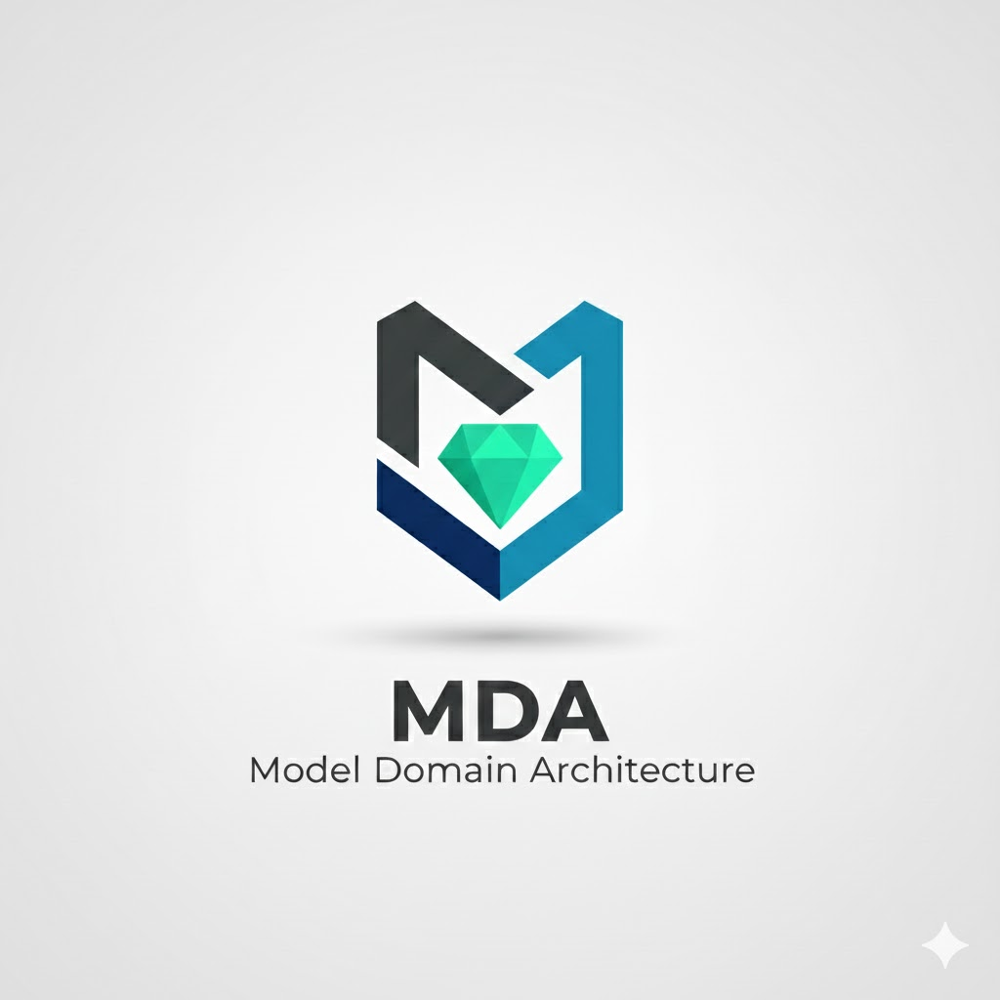

<p align="center">
  <a href="README.md"></a>
  &nbsp;&nbsp;&nbsp;
  <a href="README.en.md"></a>
</p>

<p align="center">
  
</p>

> **Nota importante**
>
> Model Domain Architecture (MDA) es un enfoque arquitectónico **pragmático y flexible**, inspirado en principios de Domain-Driven Design y Arquitectura Limpia, pero **adaptado a necesidades reales de proyectos Laravel**.
>
> Su objetivo es ser un **punto de partida claro y práctico**, no un marco rígido ni exhaustivo como DDD, Hexagonal o Clean Architecture.  
> MDA define una organización de capas y responsabilidades recomendada, **pero no impide técnicamente acceder directamente a componentes internos** (Finder, Query, Action, etc.).  
>
> El camino recomendado es siempre pasar por los Services, y solo en casos puntuales usar accesos directos, con juicio y responsabilidad. Esta base puede expandirse o ajustarse según las necesidades del proyecto.

- [Model Domain Architecture (MDA)](#model-domain-architecture-mda)
- [🎯 Objetivo](#-objetivo)
- [1. Filosofía general](#1-filosofía-general)
- [2. Estructura de carpetas](#2-estructura-de-carpetas)
- [3. Descripción de cada componente](#3-descripción-de-cada-componente)
  - [3.1 Models](#31-models)
  - [3.2 Finders](#32-finders)
  - [3.3 Queries](#33-queries)
  - [3.4 Repositories](#34-repositories)
  - [3.5 Actions](#35-actions)
  - [3.6 DTOs](#36-dtos)
  - [3.7 Services](#37-services)
  - [3.8 Use Case](#38-use-case)
- [4. Relación entre componentes](#4-relación-entre-componentes)
- [5. Ventajas de MDA](#5-ventajas-de-mda)
- [6. Ejemplo resumido de flujo](#6-ejemplo-resumido-de-flujo)
- [7. Cuándo usar MDA](#7-cuándo-usar-mda)
- [8. Cómo usar MDA (Recomendaciones y buenas prácticas)](#8-cómo-usar-mda-recomendaciones-y-buenas-prácticas)
  - [8.1 El camino recomendado](#81-el-camino-recomendado)
  - [8.2 Reglas básicas no estrictas](#82-reglas-básicas-no-estrictas)
  - [8.3 Ubicación de la lógica de negocio](#83-ubicacion-de-la-lógica-de-negocio)
  - [8.4 Pragmatismo sobre purismo](#84-pragmatismo-sobre-purismo)
  - [8.5 MDA es un punto de partida](#85-mda-es-un-punto-de-partida)
- [9. Conclusión](#9-conclusión)

# Model Domain Architecture (MDA)

La **Model Domain Architecture (MDA)** es un enfoque arquitectónico pragmático, inspirado en principios de Domain-Driven Design (DDD) y Arquitectura Limpia, pero adaptado específicamente a proyectos Laravel donde la separación natural se da por **modelos** más que por dominios conceptuales complejos.

MDA organiza el proyecto alrededor de los *modelos centrales* del sistema (por ejemplo: `User`, `Order`, `Product`, etc.), manteniendo una estructura clara, escalable y fácil de navegar incluso en aplicaciones con múltiples bases de datos.

---

## 🎯 Objetivo

Proveer una arquitectura:

* **Escalable**: que soporte crecimiento sin producir clases gigantes o repositorios inmanejables.
* **Organizada por modelo**: cada modelo tiene su propio mini-módulo con todos sus comportamientos.
* **Predicible**: cualquier desarrollador sabe exactamente dónde buscar la lógica relacionada a un modelo.
* **Práctica**: evita el sobre-engineering innecesario que a veces surge con DDD completo.

---

# 1. Filosofía general

En MDA cada modelo del sistema funciona como un "dominio acotado". No un *bounded context* como en DDD, sino un **área funcional delimitada por el propio modelo y su base de datos**.

Cada modelo contiene:

* **Actions** (comportamientos que modifican el estado)
* **Use Case**
* **Finders** (consultas simples)
* **Queries** (consultas complejas)
* **DTOs**
* **Repositories**
* **Services** (el orquestador principal)

Esto crea pequeñas islas de responsabilidad clara.

---

# 2. Estructura de carpetas

```
app/
  Actions/
    Order/
    User/
    Product/
  DTO/
    Order/
    User/
    Product/
  Finders/
    OrderFinder.php
    UserFinder.php
    ProductFinder.php
  Queries/
    Order/
    User/
    Product/
  Repositories/
    OrderRepository.php
    UserRepository.php
    ProductRepository.php
  Services/
    Interfaces/
      OrderServiceInterface.php
      ClientServiceInterface.php
    OrderService.php
    ClientService.php
  UseCases/  
  Models/
    Main/
      Order.php
      User.php
      Product.php
    Logistic/
      Delivery.php
```
> Nota:
> Models se agrupan por base de datos cuando la aplicación utiliza múltiples conexiones.
> Esta es una excepción válida porque responde a necesidades de infraestructura, no de dominio.

---

# 3. Descripción de cada componente

## 3.1 Models

Eloquent Models divididos por base de datos.

Esto es una excepción dentro de la arquitectura porque el modelo **refleja la estructura física**.

Ventajas:

* Facilita ver qué modelos pertenecen a qué base.
* Evita caos cuando existen múltiples conexiones.

---

## 3.2 Finders

> Un objeto cuyo propósito es encontrar y devolver entidades o colecciones del dominio, encapsulando cómo se accede a los datos.


* `findById($id)`
* `findByUserId($userId)`
* `findByLastOrderWithPendingItemsByUserId($userId$)`

Todos pueden ser complejos y siguen siendo Finders.

Se agrupan **por modelo**, en un único archivo por modelo:

```
OrderFinder.php
UserFinder.php
```

🔀 Variaciones posibles en la organización de Finders

MDA propone, por defecto, agrupar todos los métodos de lectura simples de un modelo en un único archivo, por ejemplo:

* UserFinder.php
* OrderFinder.php

Esto mantiene el árbol de directorios liviano y evita crear decenas de clases pequeñas.

Sin embargo, esta no es la única forma válida de organizar los Finders.
Si tu equipo prefiere una estructura más granular —por ejemplo, una clase Finder por consulta:

```
FindUserById.php
FindUsersByRole.php
FindOrdersByCustomer.php
```

También es totalmente compatible con MDA.

La idea central es que:

Las consultas simples estén separadas del servicio y la lógica de negocio.

La organización interna sea coherente para tu proyecto.

El equipo pueda modificar o escalar la estructura sin fricción.

En otras palabras:

>MDA define dónde viven las cosas, pero no cómo deben verse exactamente.
>Cada proyecto puede ajustar el nivel de granularidad que prefiera.


Regla general:

> * Si devuelve entidades: Finder
> * Si devuelve datos para mostrar/usar: Query

---

## 3.3 Queries

> Un objeto orientado a lecturas específicas para consumo, normalmente optimizadas, agregadas o proyectadas.

Consultas SQL/Eloquent complejas:

* joins múltiples
* filtros avanzados
* agregaciones
* subconsultas
* lógica de lectura específica

Se agrupan por **carpetas de modelo**, por ejemplo:

```
Queries/Order/OrderQueries.php
Queries/User/UserQueries.php
```

Ejemplos de funciones:

* getCreditsSummaryByClientId($clientId)
* getTotalClientOrdersForDashboard($clientId)


Los queries están aislados porque **es normal** que crezcan mucho.

---

## 3.4 Repositories

Clases enfocadas en **persistencia básica**:

* `create()`
* `update()`
* `delete()`

Evitan la sobrecarga de tener 50 métodos especializados dentro del repositorio.

Las consultas complejas NO se mezclan aquí; van en Queries.

Las búsquedas simples NO se mezclan aquí; van en Finders.

---

## 3.5 Actions

Comportamientos modificadores del dominio:

* UpdateOrderAction
* CreateClientAction
* DeleteUserAction

> Actions representan operaciones concretas que modifican el estado de uno o varios modelos

Las Actions usan repositorios y nunca queries.

---

## 3.6 DTOs

Objetos para transportar datos, ordenar requests y respuestas.

Separados por modelo.

---

## 3.7 Services

Los Services encapsulan la lógica específica de un modelo o una operación reutilizable.

Un Service puede:

- Usar Finders para lecturas simples
- Usar Queries para lecturas complejas
- Ejecutar Repositories para persistencia
- Aplicar reglas de negocio propias del modelo

Los Services **no deben decidir flujos de alto nivel** ni contener lógica de casos de uso compuestos. Eso es responsabilidad de las **Actions** o **Use Cases**.

---

## 3.8 Use Case


Un **Use Case** corresponde a un caso de uso del sistema que:

- **no representa un único modelo**, sino que combina operaciones sobre múltiples modelos,
- **agrega lógica de negocio transversal**,
- y **orquesta llamadas a varios servicios/consultas/repositorios asociados**.

Ejemplos típicos de Use Case pueden ser:

- NotificacionesService (usa UserService, PaymentService, etc.)
- Liquidaciones que combinan múltiples entidades
- Reportes o sincronizaciones complejas del ecosistema

Los Use Case son conceptualmente similares a lo que en otras arquitecturas se conoce como:

- Domain Services  
- Application Services (en Clean Architecture)  
- Casos de uso transversales que requieren coordinación de varios modelos.

Integrar este tipo de servicios de forma explícita en MDA permite mantener la estructura **uniforme, predecible y escalable** sin forzar que todo dependa de un único modelo.

---

# 4. Relación entre componentes

Flujo recomendado:

```
Controller → Use Case → Services 
Services → Finder / Query
Services → Action → Repository
```

No siempre es necesario un UseCase, asi que puede desde el controller llamar directo al Service

```
Controller → Services
```

Donde:

  * **Controller**: adapta entrada/salida y delega.
  * **UseCase**: caso de uso que orquesta el flujo completo y toma decisiones de alto nivel.
  * **Services**: lógica específica de modelo o reutilizable.
  * **Finder / Query**: acceso a datos de lectura.
  * **Action**: operación específica de escritura o modificación de estado.
  * **Repository**: persistencia (create/update/delete).

Relaciones específicas:

  * UseCase → Services
  * Services → Finder / Query
  * Services → Action
  * Action → Repository
  * Finder → Eloquent (lecturas simples)
  * Query → SQL/Eloquent complejo

Las dependencias deben ser **unidireccionales, claras y limpias**.

---

# 5. Ventajas de MDA

### ✓ Escalabilidad natural

A medida que crece el proyecto, solo crecen carpetas dentro del modelo correspondiente.

### ✓ Navegación inmediata

Todo lo relacionado a `Order` está en un mismo "dominio de modelo".

### ✓ Sin super-repositorios gigantes

Las consultas específicas no se mezclan con las CRUD básicas.

### ✓ Alineado a la realidad de muchos proyectos Laravel

Muchos proyectos no tienen dominios de negocio bien definidos para aplicar DDD completo.

### ✓ Compatible con DDD parcial

Si algún día aparece un dominio grande (por ejemplo, "Finanzas"), puede agrupar varios modelos bajo un contexto.

---

# 6. Ejemplo resumido de flujo

Controller de Ordenes:

```
$order = $orderService->findById($id);
```

Service:

```
return $this->finder->findById($id);
```

Consulta compleja:

```
$orders = $orderService->getOrdenesConDescuento();
```

Service llama:

* Queries/Order/getOrdenesConDescuento

Actualización:

```
$orderService->actualizarEstado($id, $dto);
```

Service → Action → Repository

---

# 7. Cuándo usar MDA

Ideal para proyectos:

* Laravel
* con múltiples modelos
* con consultas muy diversas
* con necesidad de orden y escalabilidad
* donde DDD completo es demasiado

No tan ideal en:

* sistemas extremadamente pequeños

---

# 8 Como usar MDA (Recomendaciones y buenas prácticas)

MDA define una estructura clara y responsabilidades bien delimitadas, pero no impone restricciones técnicas rígidas.
No es una arquitectura que “te impide” hacer cosas, sino una que te sugiere caminos preferidos.

Esta sección describe cómo se espera usar MDA en la práctica, y qué decisiones son recomendadas… aunque no obligatorias.

---
## 8.1 El camino recomendado

La idea general es:

Controller → Action → Services → (Finder / Query / Repository)

Los Controllers no contienen lógica de negocio.
Delegan la ejecución a una Action.

Las Actions representan casos de uso:
- coordinan servicios
- definen el flujo
- manejan decisiones de alto nivel

Desde una Action se puede:

- leer datos mediante Finders o Queries
- ejecutar lógica reutilizable mediante Services
- persistir mediante Repositories

Este flujo mantiene:

- trazabilidad
- menor acoplamiento
- una intención clara del código

---

## 8.2 Reglas básicas no estrictas

MDA no bloquea técnicamente otros accesos.

Por ejemplo:

- Podés llamar a una Action directamente desde un Controller
- Podés reutilizar una Action desde distintos puntos de entrada
- Podés ejecutar una Query sin pasar por un Service
- Podés llamar a un Finder directamente desde un Service

👉 Nada lo impide.

La diferencia clave es **la intención**.

Recomendación:

- Las Actions son puntos de entrada válidos para casos de uso
- Los accesos directos a Finders / Queries son excepciones
- Si un acceso directo empieza a repetirse:
  - probablemente merece su propia Action
  - o el caso de uso no estaba bien modelado

MDA prioriza claridad antes que enforcement técnico.

---

## 8.3 Ubicacion de la lógica de negocio

La lógica de negocio debería vivir fuera de controllers

Preferentemente dentro de:

* Services
* Actions
* (o Domain logic si el proyecto lo requiere)

MDA no fuerza el uso de:
  * Aggregates
  * Domain Events
  * Value Objects

Pero no los prohíbe.

Si un proyecto crece y necesita conceptos más avanzados, MDA puede:

  * convivir con ellos
  * servir como base organizacional
  * o ser extendido gradualmente

---
## 8.4 Pragmatismo sobre purismo

MDA nace desde la práctica, no desde la teoría.

Si una regla:
  * complica innecesariamente el código
  * retrasa una entrega crítica
  * agrega fricción sin beneficio claro

Romperla conscientemente es preferible a seguirla a ciegas.

La clave es:
  * entender por qué existe la recomendación
  * y qué costo tiene ignorarla

---

## 8.5 MDA es un punto de partida

MDA no intenta:

  * cubrir todos los escenarios posibles
  * competir con arquitecturas completas como DDD
  * definir una verdad absoluta

Su objetivo es:

  * ofrecer una base clara y usable
  * reducir el caos en proyectos reales
  * dar estructura sin sobreingeniería

Si en algún punto necesitás más, probablemente:

> ya sabés mejor que MDA qué es lo que hace falta.

---

# 9. Conclusión

La **Model Domain Architecture (MDA)** ofrece un balance perfecto entre organización, escalabilidad y simplicidad. Su premisa fundamental es que los modelos son el eje central del diseño, y todo lo relacionado a un modelo vive junto a él.

Es una arquitectura práctica, realista y altamente usable en equipos que trabajan con Laravel, especialmente con múltiples bases de datos y dominios que no encajan perfectamente en DDD tradicional.

---


